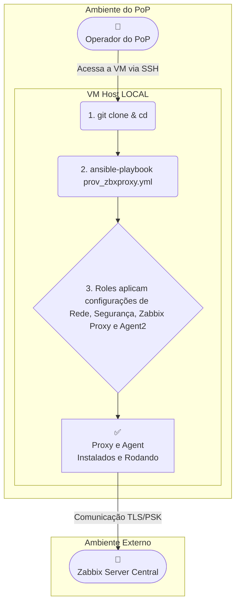

# 🤖 Provisionamento Automatizado de Zabbix Proxy com Ansible

## 📜 Sumário

- [Visão Geral](#visao-geral)
- [Principais Funcionalidades](#principais-funcionalidades)
- [Arquitetura de Execução](#arquitetura-de-execucao)
- [Estrutura das Roles](#estrutura-das-roles)
- [Começando](#comecando)
  - [Pré-requisitos](#pre-requisitos)
  - [Workflow de Provisionamento](#workflow-de-provisionamento)
- [Configuração Detalhada](#configuracao-detalhada)
- [Resultados Esperados](#-resultados-esperados)
- [Limitações e Observações](#limitacoes-e-observacoes)
- [Autores](#autores)

---

<a id="visao-geral"></a>
## 📖 Visão Geral

O projeto automatiza, via **Ansible**, a implantação e configuração completa de um **Zabbix Proxy** em servidores **Debian 12 (Bookworm)**.  
A automação é executada **localmente no host de destino** e inclui:

- Configuração de rede e hardening de segurança (UFW, Fail2Ban, SSH).  
- Instalação e configuração do Zabbix Proxy e Zabbix Agent 2.  
- Registro seguro (TLS/PSK) do Proxy no Zabbix Server.  
- Registro do Agent 2 do próprio host no Zabbix Server.  

O objetivo é fornecer um método rápido, seguro e replicável para implantar novos Zabbix Proxies em Pontos de Presença (POPs) distintos, garantindo um estado final consistente e pronto para produção.  


**Versão 6**
---

<a id="principais-funcionalidades"></a>
## ✨ Principais Funcionalidades

- 🚀 **Execução Local:** O playbook roda no próprio servidor de destino, simplificando o processo.  
- 🔄 **Automação de Ponta a Ponta:** Desde a rede e segurança até a instalação e registro dos serviços Zabbix.  
- ♻️ **Idempotente:** Pode ser executado várias vezes com segurança, garantindo sempre o estado final desejado.  
- 🌍 **Configuração por Localidade:** Estrutura de `group_vars` que facilita a customização para múltiplos POPs.  
- 🛡️ **Segurança Integrada:** Hardening com firewall (UFW), Fail2Ban e customização do acesso SSH.  
- 🔗 **Integração via API:** Registro automático do Proxy e do Agent 2 no Zabbix Server.  

---

<a id="arquitetura-de-execucao"></a>
## 🏛️ Arquitetura de Execução

A automação acontece inteiramente no Host de Destino. Um operador acessa o servidor, clona o repositório e executa o playbook, que configura a máquina localmente.  
A única comunicação externa é com a API e os trappers do Zabbix Server.  



---

<a id="estrutura-das-roles"></a>
## 🧩 Estrutura das Roles

| Role | Descrição |
| :--- | :--- |
| `setup_context` | **Ponto de Partida.** Identifica o grupo do host no inventário e carrega variáveis correspondentes. |
| `net_security` | **Camada de Base.** Hardening do servidor: hostname, rede, firewall, Fail2Ban e SSH. |
| `zabbix_proxy` | **Aplicação Principal.** Instala e configura o Zabbix Proxy e sua chave PSK. |
| `zabbix_agent` | **Aplicação Auxiliar.** Instala e configura o Zabbix Agent 2 para monitorar o próprio host. |
| `zabbix_server_register_proxy` | **Integração (Proxy).** Registra/atualiza o Proxy via API. |
| `zabbix_server_register_agent` | **Integração (Host).** Registra/atualiza o host correspondente ao Agent 2 via API. |

---

<a id="comecando"></a>
## 🚀 Começando

<a id="pre-requisitos"></a>
### ✅ Pré-requisitos

O **servidor de destino** deve atender aos seguintes requisitos:

- **SO:** Debian 12 (Bookworm)  
- **Usuário:** Com permissões `sudo`  
- **Pacotes Essenciais:**  
  ```bash
  sudo apt update && sudo apt install -y git ansible-core
  ```
- **Coleções Ansible:**  
  ```bash
  ansible-galaxy collection install community.general
  ```
- **Versões Zabbix (testadas):**  
  - `zabbix-proxy-sqlite3=1:7.2.7-1+debian12`  
  - `zabbix-agent2=1:7.2.7-1+debian12`  

---

<a id="workflow-de-provisionamento"></a>
### ⚙️ Workflow de Provisionamento

1. **Clonar o Repositório**  
   ```bash
   git clone https://git.rnp.br/gt-monitoramento/poc-monitoramento.git
   cd dev-zbxproxy/
   ```

2. **Configurar Variáveis**  
   Ajuste os arquivos em `group_vars/pop_configs/sigla_do_estado.yml` conforme seu ambiente. Veja a seção [Configuração Detalhada](#configuracao-detalhada).  

3. **Executar o Playbook**  
   ```bash
   ansible-playbook -i hosts prov_zbxproxy.yml --limit sigla_do_estado -K
   ```

Guia rápido do -v para debug:

| Parâmetro | Descrição |
| :--- | :--- |
| `--limit <grupo>` | Executa apenas para o grupo especificado (ex: `ce`). |
| `-K` | Solicita senha do `sudo` da VM. |
| `-v` | Verbose / Detalhado |
| `-vv` | Very Verbose / Muito Detalhado |
| `-vvv` | Verbosidade extra para debug. |
| `-vvvv` | Debug Maximo |

Ex:
   ```bash
   ansible-playbook -i hosts prov_zbxproxy.yml --limit sigla_do_estado -K -v
   ```
---

<a id="configuracao-detalhada"></a>
## 🔧 Configuração Detalhada

A personalização do provisionamento é feita em dois níveis: **variáveis globais** que se aplicam a todos os proxies e **variáveis locais** específicas para cada Ponto de Presença (POP). 
Não é recomendado alterar as variáveis globais, pois estes valores foram parâmetrizados pela GER/Backbone para compatibilidade com o Zabbix Server Central.


#### 1\. Configurações Locais (Específicas do POP)

Estas variáveis definem a identidade e a configuração de rede de um proxy específico.

**Diretório:** `group_vars/pops_configs/sigla_do_estado.yml`

O nome do arquivo YAML nesta pasta **deve ser idêntico** ao nome do grupo definido no inventário (`hosts`). É essa convenção que permite ao Ansible carregar as configurações corretas para a localidade desejada.

**Exemplo:** Para o grupo `[ce]` no inventário, edite o arquivo `group_vars/pops_configs/ce.yml`.

As variáveis essenciais a serem configuradas são:

  * **`zabbix_proxy_hostname`**: O nome de host único para este proxy. Este nome será usado tanto no arquivo de configuração local quanto no registro no Zabbix Server.
    ```yaml
    zabbix_proxy_hostname: "ce-zabbix-rnp-ger-proxy01"
    ```
  * **Parâmetros de Rede**: Configure a interface de rede, endereços IP, gateway e DNS para a máquina.
    ```yaml
    pop_network_ipv4_address: "192.168.0.17/24"
    pop_network_ipv4_gateway: "192.168.0.9"
    pop_network_dns_list:
      - "200.19.16.53" # dns rnp
     -  "200.137.53.53" # dns rnp

    ```
  * **Porta SSH**: A porta customizada para o acesso SSH, que será configurada no firewall.
    ```yaml
    ssh_port: 25085
    ```

#### 2\. Recomendações Críticas de Segurança e Operação

  - **📸 Snapshot da VM:** Antes de executar o playbook pela primeira vez, é uma prática de segurança **altamente recomendada** criar um snapshot. Isso garante um ponto de retorno instantâneo caso alguma configuração de rede ou firewall bloqueie seu acesso.

  - **🔒 Acesso SSH:** A automação **altera a porta padrão do SSH** para o valor definido em `ssh_port` na variável local do POP. Após a execução, você só conseguirá acessar a máquina através da nova porta.

  - **🧱 Firewall (UFW):** O UFW é ativado e configurado para bloquear todas as conexões, exceto as permitidas (SSH, Zabbix). Certifique-se de que o IP do seu gateway (`pop_network_ipv4_gateway`) ou o IP da sua máquina de acesso esteja na lista de permissões para não ser bloqueado.


---
<a id="resultados-esperados"></a>

## ✅ Resultados Esperados

Após a execução bem-sucedida do playbook, a configuração no Zabbix Server deve se apresentar da seguinte forma. Esta seção serve como um guia visual para confirmar que tudo funcionou corretamente.

### 1. Status do Proxy

Navegue até **Administração -> Proxies** na interface do Zabbix.

Você deverá encontrar o proxy recém-criado com as seguintes características:
-   **Modo:** Ativo
-   **Encriptação:** PSK
-   **Estado:** Online
-   **Última vez visto (idade):** Um valor baixo, como "alguns segundos", indicando comunicação ativa e recente com o Zabbix Server.

### 2. Status do Host (Agente)

Navegue até **Monitoramento -> Hosts**.

Você deverá encontrar o host correspondente ao agente do proxy com os seguintes indicadores:
-   O nome do host (ex: `ce-zabbix-rnp-ger-proxy01`) estará na lista.
-   A coluna **Disponibilidade** mostrará um **ícone ZBX verde**, confirmando que o Zabbix Server está conseguindo coletar dados do agente via TLS/PSK.
-   Ao clicar no host para editar, a opção **Monitorado por** estará corretamente marcada como **Servidor**.


---

<a id="limitacoes-e-observacoes"></a>
## ⚠️ Limitações e Observações

- A API do Zabbix não permite associar IP/DNS ao Proxy durante a criação (`proxy.create`).  
- Após rodar a automação, edite manualmente o **endereço do proxy** via UI em `Administração > Proxies`.  

---

<a id="autores"></a>
## 👨‍💻 Autores

- **GT Monitoramento 2025**


